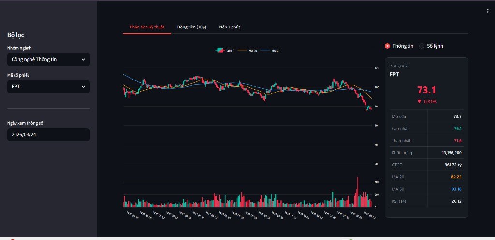
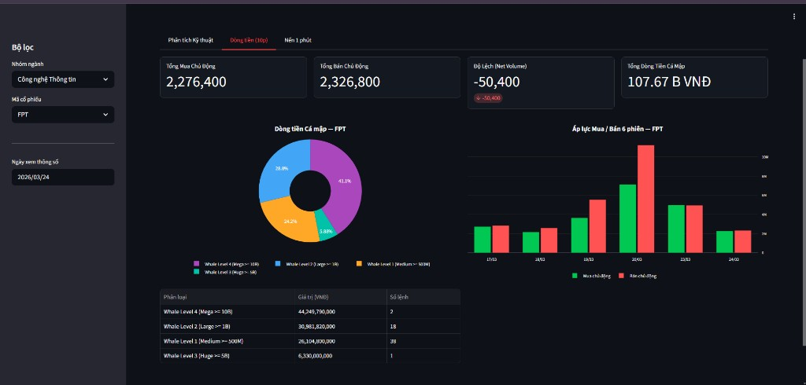
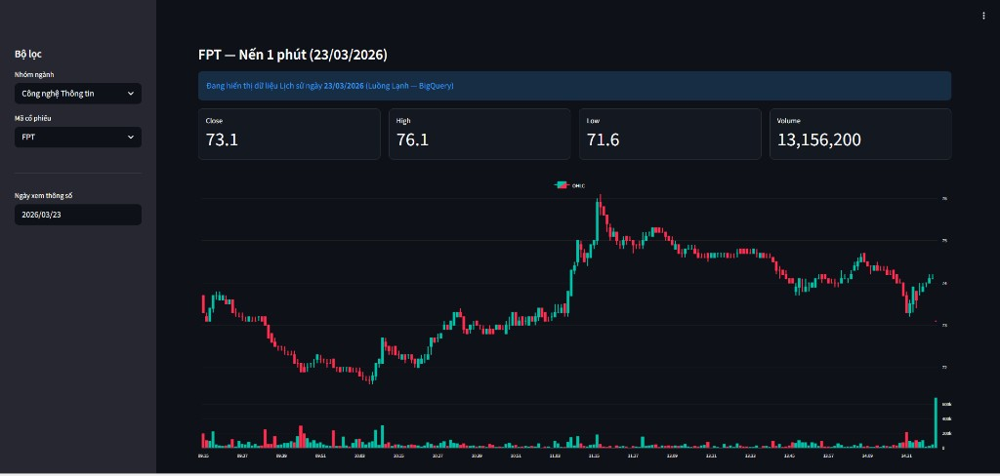
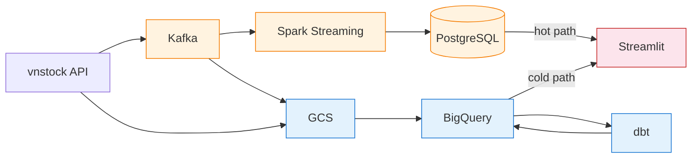
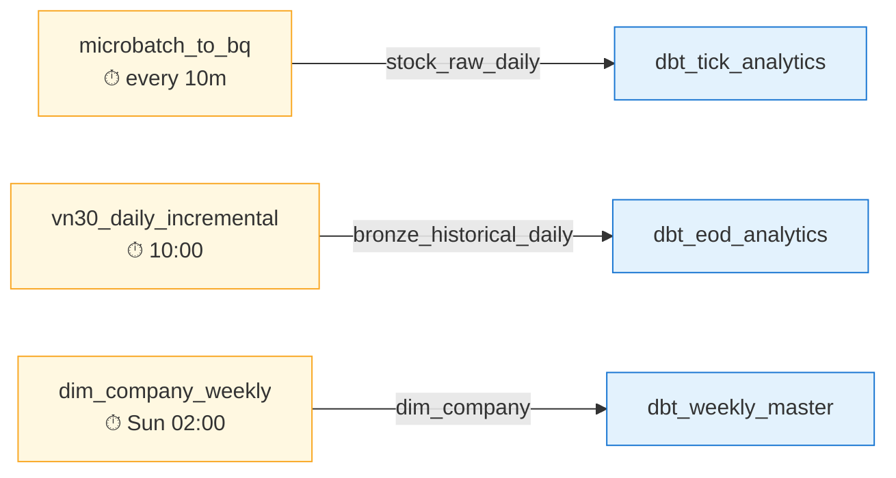
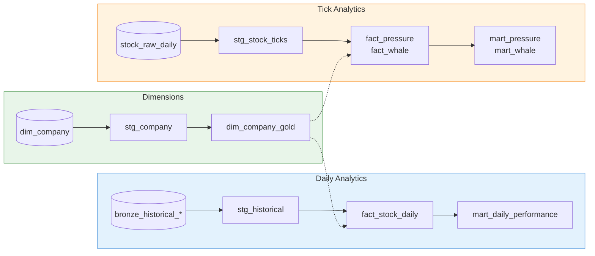

<p align="center">
  <h1 align="center">Vietnam Stock Market — Real-time Data Platform</h1>
</p>

<p align="center">
  <strong>Lambda Architecture pipeline for VN30 stocks — Kafka, Spark, Airflow, dbt & BigQuery</strong>
</p>

<p align="center">
  
  
  
  
  
  
  
  
  
</p>

---

End-to-end **Lambda Architecture** data platform that ingests real-time tick data from the Vietnam stock market (HOSE/HNX) via `vnstock`, processes it through both a **speed layer** (Kafka → Spark → PostgreSQL) and a **batch layer** (GCS → BigQuery → dbt), and serves analytics through a Streamlit dashboard. Covers **VN30 index** with tick-level granularity, daily OHLCV, buy/sell pressure, whale detection, and technical indicators (MA20, MA50, RSI-14).

---

## Dashboard Preview

### Technical Analysis — Daily candlestick with MA20/MA50 & RSI-14


### Money Flow — Whale detection & buy/sell pressure


### 1-Minute Candles — Intraday chart (live from PostgreSQL / historical from BigQuery)


---

## Architecture Overview



---

## Data Flow

| Path | Flow | Latency |
|------|------|---------|
| **Hot** | vnstock API → Kafka → Spark Streaming → PostgreSQL → Streamlit | ~30s |
| **Warm** | Kafka → `kafka_to_gcs.py` → GCS Parquet → BigQuery → dbt (tick models) → Streamlit | ~10 min |
| **Cold** | vnstock History API → GCS → BigQuery Bronze → dbt (EOD models) → Streamlit | Daily/Weekly |

---

## Project Structure

```
stock-streaming-de/
├── docker-compose.yaml          # 5 containers (Kafka, Postgres, Redis, Airflow, Streamlit)
├── Dockerfile                   # Airflow image (Spark + Java + dbt)
├── producer.py                  # Kafka producer (local dev)
├── spark.py                     # Spark streaming (local dev)
├── data/
│   ├── producer.py              # Kafka producer (Docker — multi-thread, dedup)
│   └── spark.py                 # Spark streaming (Docker — watermark + dedup)
├── dags/
│   ├── stock_pipeline.py        # Realtime orchestrator (Producer + Spark)
│   ├── batch_datalake_dag.py    # Kafka → GCS → BQ (every 10m)
│   ├── stop_realtime_dag.py     # Auto-shutdown at 15:05
│   ├── vn30_daily_incremental_dag.py
│   ├── vn30_historical_bootstrap_dag.py
│   ├── vn30_financial_statements_weekly.py
│   ├── dim_company_dag.py
│   ├── dbt_tick_analytics.py    # Dataset-triggered
│   ├── dbt_eod_analytics.py     # Dataset-triggered
│   ├── dbt_weekly_master.py     # Dataset-triggered
│   └── scripts/
│       ├── kafka_to_gcs.py
│       └── fetch_dim_company.py
├── dbt/
│   ├── dbt_project.yml
│   └── models/
│       ├── staging/             # stg_stock_ticks, stg_company, stg_historical_*
│       ├── dim_fact/            # dim_company_gold, dim_trading_calendar, fact_*
│       └── marts/               # mart_daily_stock_performance, mart_intraday_*
├── streamlit_app/
│   ├── app.py                   # Dashboard (3 tabs, 1000+ lines)
│   └── data/                    # BQ & PG connectors
└── assets/                      # Screenshots
```

---

## Tech Stack

| Layer | Technology | Purpose |
|-------|-----------|---------|
| **Ingestion** | vnstock (Python) | Vietnam stock market API |
| **Broker** | Kafka 3.7 (KRaft) | Real-time tick streaming |
| **Stream** | Spark 3.5 (Structured Streaming) | 1-min OHLCV aggregation |
| **Orchestration** | Airflow 2.8.1 | DAG scheduling + Dataset triggers |
| **Lake** | Google Cloud Storage | Raw Parquet storage |
| **Warehouse** | BigQuery | Bronze → Silver → Gold |
| **Transform** | dbt-bigquery | Incremental models, partitioning |
| **Serving** | PostgreSQL 13 / BigQuery Marts | Hot (live) / Cold (analytics) |
| **Dashboard** | Streamlit + Plotly | Interactive charts |
| **Infra** | Docker Compose | Single-command deployment |

---

## DAG Dependency Graph

Pipeline uses Airflow **Datasets** for event-driven cross-DAG triggering:



Other time-scheduled DAGs: `vietstock_auto_pipeline` (09:00), `stock_realtime_shutdown` (15:05), `vn30_financial_statements_weekly` (Sun 06:00), `vn30_historical_bootstrap` (manual).

---

## dbt Lineage Graph

Three independent pipelines from source to mart:



`dim_company_gold` and `dim_trading_calendar` are shared dimensions joined into all fact tables.

---

## Getting Started

### Prerequisites

- **Docker & Docker Compose** (v2+)
- **GCP Service Account** with BigQuery Data Editor, BigQuery Job User, Storage Object Admin

### Setup

```bash
# 1. Clone
git clone https://github.com/<your-username>/stock-streaming-de.git
cd stock-streaming-de

# 2. Environment
cp streamlit_app/.env.example .env
# Edit .env → set POSTGRES_PASSWORD, KAFKA_BROKER, TOPIC_NAME

# 3. GCP credentials
cp your-service-account.json ./gcpkey.json
cp your-service-account.json ./data/gcpkey.json

# 4. dbt profile
cat > dbt/profiles.yml << 'EOF'
my_dbt_project:
  target: dev
  outputs:
    dev:
      type: bigquery
      method: service-account
      project: <your-gcp-project-id>
      dataset: stock_data_warehouse
      threads: 4
      keyfile: /opt/airflow/google-credentials.json
      location: asia-southeast1
EOF

# 5. Launch
docker compose up -d --build
```

### Services

| Service | Port | URL |
|---------|------|-----|
| Airflow | 8080 | http://localhost:8080 (admin/admin) |
| Streamlit | 8501 | http://localhost:8501 |
| Kafka | 9092 | — |
| PostgreSQL | 5432 | — |
| Redis | 6379 | — |

> **First run:** Trigger `vn30_historical_bootstrap` manually for backfill, then `update_dim_company_weekly` for company dimension.

---

## Configuration

| Variable | Description |
|----------|-------------|
| `POSTGRES_PASSWORD` | PostgreSQL password |
| `KAFKA_BROKER` | Broker address (Docker: `kafka:29092`) |
| `TOPIC_NAME` | Kafka topic (default: `stock_ticks_realtime`) |
| `VNSTOCK_API_KEY` | Optional premium API key |

| GCP File | Container Path | Used By |
|----------|---------------|---------|
| `./gcpkey.json` | `/opt/airflow/google-credentials.json` | Airflow |
| `./data/gcpkey.json` | `/app/gcpkey.json` | Streamlit |

---

## Key Data Schemas

### `stock_raw_daily` (Bronze — ticks from Kafka)

| Column | Type | Description |
|--------|------|-------------|
| `time` | TIMESTAMP | Trade time |
| `price` | STRING | Price (×1000 = VND) |
| `volume` | STRING | Volume |
| `match_type` | STRING | Buy / Sell / ATO / ATC |
| `symbol` | STRING | Ticker |

### `fact_stock_daily` (Gold — daily indicators)

| Column | Type | Description |
|--------|------|-------------|
| `symbol` | STRING | Ticker |
| `trading_date` | DATE | Date |
| `close_price` | NUMERIC | Close price |
| `pct_change` | NUMERIC | Daily % change |
| `ma_20` / `ma_50` | NUMERIC | Moving averages |
| `rsi_14` | NUMERIC | RSI (Cutler's) |

### `fact_whale_transactions` (Gold — large trades ≥ 500M VND)

| Column | Type | Description |
|--------|------|-------------|
| `symbol` | STRING | Ticker |
| `trade_value` | NUMERIC | Value (VND) |
| `whale_category` | STRING | Level 1–4 (500M → 10B+) |
| `match_type` | STRING | Buy / Sell |

### `stock_candles` (PostgreSQL — live 1-min OHLCV)

| Column | Type | Description |
|--------|------|-------------|
| `symbol` | VARCHAR | Ticker |
| `window_start` | TIMESTAMP | Candle start |
| `open/high/low/close_price` | DOUBLE | OHLCV |
| `volume` | BIGINT | Total volume |

---

## Monitoring & Operations

### Daily Timeline (UTC+7)

| Time | Event |
|------|-------|
| 09:00 | Producer + Spark start |
| 09:00–15:00 | Micro-batch every 10 min |
| 10:00 | Daily incremental ingestion |
| 15:05 | Auto-shutdown (kill Producer/Spark) |
| Sun 02:00 | Company dimension refresh |
| Sun 06:00 | Financial statements refresh |

### Commands

```bash
docker compose down          # Graceful shutdown
docker compose down -v       # Full cleanup (removes data)
docker compose restart airflow
```

### Resource Limits

| Container | Memory |
|-----------|--------|
| Airflow | 6 GB |
| Kafka / Postgres / Streamlit | 1 GB each |
| Redis | 256 MB |

> Minimum recommended: **10 GB RAM** for Docker

---

## Roadmap

- [ ] Slack/Telegram alerts for DAG failures
- [ ] dbt tests & data quality checks
- [ ] CI/CD with GitHub Actions
- [ ] More indicators: Bollinger Bands, MACD, VWAP
- [ ] Terraform for GCP infrastructure
- [ ] Extend beyond VN30 to full market

---

## Contributing

1. Fork → `git checkout -b feature/my-feature` → make changes → PR
2. dbt compile check: `docker compose exec airflow bash -c "cd /opt/airflow/dbt && dbt compile"`

---

