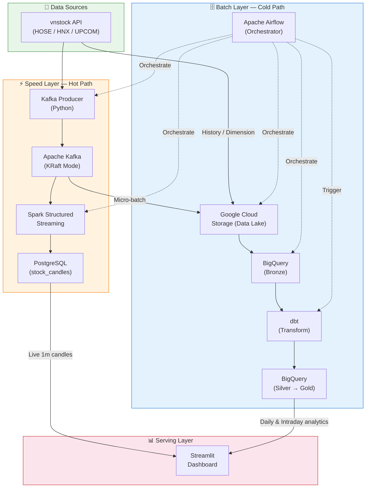
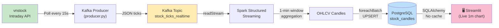
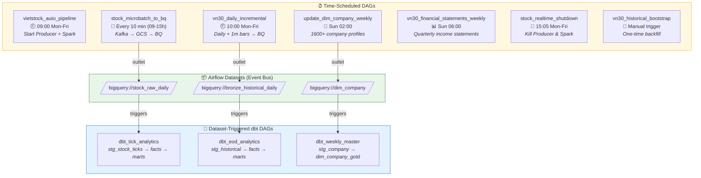
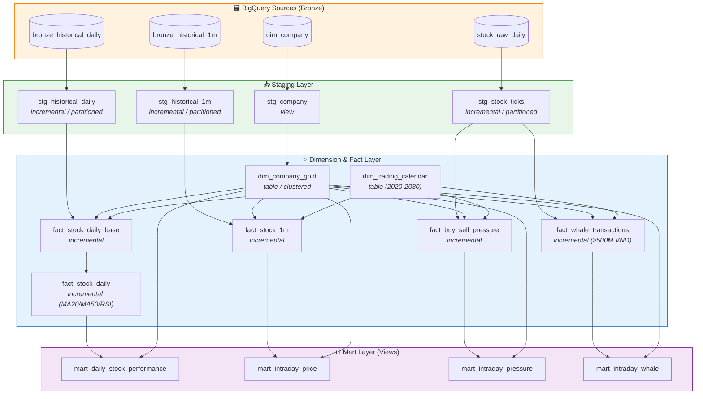

<p align="center">
  <h1 align="center">Vietnam Stock Market — Lambda Architecture Data Platform</h1>
</p>

<p align="center">
  <strong>Real-time & batch analytics pipeline for VN30 stocks, powered by Kafka, Spark, Airflow, dbt & BigQuery</strong>
</p>

<p align="center">
  
  
  
  
  
  
  
  
  
</p>

---

An end-to-end **Lambda Architecture** data platform that ingests real-time tick data from the Vietnam stock market (HOSE/HNX) via the `vnstock` API, processes it through both a **speed layer** (Kafka → Spark Streaming → PostgreSQL) and a **batch layer** (GCS → BigQuery → dbt), and serves unified analytics through a Streamlit dashboard. The system tracks **VN30 index constituents** with intraday tick-level granularity, daily OHLCV candles, buy/sell pressure classification, whale transaction detection, and technical indicators (MA20, MA50, RSI-14).

---

## Table of Contents

- [Architecture Overview](#architecture-overview)
- [Data Flow Diagram](#data-flow-diagram)
- [Project Structure](#project-structure)
- [Tech Stack](#tech-stack)
- [DAG Dependency Graph](#dag-dependency-graph)
- [dbt Lineage Graph](#dbt-lineage-graph)
- [Getting Started](#getting-started)
- [Configuration](#configuration)
- [Pipeline Modules](#pipeline-modules)
- [Data Schema](#data-schema)
- [Monitoring & Operations](#monitoring--operations)
- [Contributing](#contributing)
- [Roadmap](#roadmap)

---

## Architecture Overview



---

## Data Flow Diagram

### Hot Path (Speed Layer) — Real-time



**Latency:** ~15 seconds (producer poll) + ~15 seconds (Spark trigger) ≈ **30s end-to-end**

### Warm Path (Micro-batch) — Every 10 minutes

```mermaid
flowchart LR
    A["Kafka Topic<br/>stock_ticks_realtime"] -->|Consumer drain| B["kafka_to_gcs.py<br/>(Parquet)"]
    B -->|Upload| C["GCS<br/>raw/YYYY/MM/DD/"]
    C -->|GCSToBigQuery| D[("BigQuery<br/>stock_raw_daily")]
    D -->|Dataset event| E["dbt_tick_analytics"]
    E --> F["stg_stock_ticks"]
    F --> G["fact_buy_sell_pressure<br/>fact_whale_transactions"]
    G --> H["mart_intraday_pressure<br/>mart_intraday_whale"]
    H --> I["🖥️ Streamlit<br/>(Order Book & Whale)"]

    style A fill:#FFECB3
    style D fill:#BBDEFB
    style H fill:#D1C4E9
    style I fill:#F8BBD0
```



### Cold Path (Batch Layer) — Daily & Weekly

```mermaid
flowchart LR
    A["vnstock<br/>History API"] -->|Daily 10:00| B["Airflow DAG<br/>vn30_daily_incremental"]
    B -->|Parquet| C["GCS<br/>bronze/daily_run/"]
    C -->|GCSToBigQuery| D[("BigQuery Bronze<br/>bronze_historical_daily<br/>bronze_historical_1m")]
    D -->|Dataset event| E["dbt_eod_analytics"]
    E --> F["stg_historical_daily<br/>stg_historical_1m"]
    F --> G["fact_stock_daily_base<br/>→ fact_stock_daily<br/>fact_stock_1m"]
    G --> H["mart_daily_stock_performance<br/>mart_intraday_price"]
    H --> I["🖥️ Streamlit<br/>(Technical Analysis)"]

    style A fill:#C8E6C9
    style D fill:#BBDEFB
    style G fill:#D1C4E9
    style I fill:#F8BBD0
```



---

## Project Structure

```
stock-streaming-de/
├── docker-compose.yaml          # Multi-service orchestration (5 containers)
├── Dockerfile                   # Airflow image (Spark + Java + dbt + providers)
├── .env                         # Environment variables (gitignored)
├── .gitignore
├── requirements.txt             # Root Python dependencies
├── producer.py                  # Kafka producer (local development)
├── mock_producer.py             # Stress-test producer (10k ticks/sec)
├── spark.py                     # Spark streaming job (local development)
│
├── data/
│   ├── producer.py              # Kafka producer (Docker — multi-threaded, dedup)
│   └── spark.py                 # Spark streaming job (Docker — watermark + dedup)
│
├── dags/                        # Airflow DAGs
│   ├── stock_pipeline.py        # Realtime pipeline orchestrator (Producer + Spark)
│   ├── batch_datalake_dag.py    # Micro-batch: Kafka → GCS → BigQuery (every 10m)
│   ├── stop_realtime_dag.py     # Auto-shutdown at market close (15:05)
│   ├── vn30_daily_incremental_dag.py   # Daily OHLCV + 1m bars ingestion
│   ├── vn30_historical_bootstrap_dag.py # One-time historical backfill
│   ├── vn30_financial_statements_weekly.py # Weekly income statements
│   ├── dim_company_dag.py       # Weekly company dimension refresh
│   ├── dbt_tick_analytics.py    # Dataset-triggered dbt (tick models)
│   ├── dbt_eod_analytics.py     # Dataset-triggered dbt (EOD models)
│   ├── dbt_weekly_master.py     # Dataset-triggered dbt (dimension models)
│   └── scripts/
│       ├── kafka_to_gcs.py      # Kafka consumer → GCS Parquet
│       └── fetch_dim_company.py # Scrape 1600+ company profiles → GCS
│
├── dbt/                         # dbt project (BigQuery transforms)
│   ├── dbt_project.yml
│   ├── profiles.yml             # BigQuery connection profile (gitignored)
│   └── models/
│       ├── staging/
│       │   ├── src_stock_raw.yml       # Source definitions
│       │   ├── stg_stock_ticks.sql     # Tick data staging (incremental)
│       │   ├── stg_company.sql         # Company profile staging (view)
│       │   ├── stg_historical_daily.sql # Daily OHLCV staging (incremental)
│       │   └── stg_historical_1m.sql   # 1-min bars staging (incremental)
│       ├── dim_fact/
│       │   ├── dim_company_gold.sql          # Company dimension (surrogate key)
│       │   ├── dim_trading_calendar.sql      # Trading calendar 2020-2030
│       │   ├── fact_stock_daily_base.sql     # Daily base (OHLCV + pct_change)
│       │   ├── fact_stock_daily.sql          # Daily + MA20/MA50/RSI-14
│       │   ├── fact_stock_1m.sql             # 1-minute fact table
│       │   ├── fact_buy_sell_pressure.sql    # Tick-level buy/sell classification
│       │   └── fact_whale_transactions.sql   # Whale trades ≥ 500M VND
│       └── marts/
│           ├── mart_daily_stock_performance.sql  # Daily KPIs + indicators
│           ├── mart_intraday_price.sql           # 1-min OHLCV with company info
│           ├── mart_intraday_pressure.sql        # Buy/sell pressure with sectors
│           └── mart_intraday_whale.sql           # Whale trades with sectors
│
└── streamlit_app/               # Visualization dashboard
    ├── Dockerfile
    ├── requirements.txt
    ├── .env.example
    ├── app.py                   # Main dashboard (1000+ lines)
    ├── components/
    │   └── __init__.py
    └── data/
        ├── __init__.py
        ├── bq_connector.py      # BigQuery connection helper
        └── pg_connector.py      # PostgreSQL connection helper
```

---

## Tech Stack

| Layer | Technology | Purpose |
|-------|-----------|---------|
| **Ingestion** | `vnstock` (Python) | Vietnam stock market API (HOSE/HNX/UPCOM) |
| **Message Broker** | Apache Kafka 3.7.0 (KRaft) | Real-time tick event streaming |
| **Stream Processing** | Apache Spark 3.5.0 (Structured Streaming) | 1-minute OHLCV candle aggregation with watermark & dedup |
| **Orchestration** | Apache Airflow 2.8.1 (LocalExecutor) | DAG scheduling, Dataset-triggered pipelines |
| **Data Lake** | Google Cloud Storage (GCS) | Raw/bronze Parquet storage |
| **Data Warehouse** | Google BigQuery | Bronze → Silver → Gold layered analytics |
| **Transformation** | dbt (dbt-bigquery) | Incremental models, partitioning, clustering |
| **Serving (Hot)** | PostgreSQL 13 | Live 1-minute candle UPSERT for real-time dashboard |
| **Serving (Cold)** | BigQuery Marts | Pre-computed views for historical analytics |
| **Cache** | Redis | Application caching layer |
| **Visualization** | Streamlit 1.55 + Plotly 6.6 | Interactive candlestick charts, whale detection, order flow |
| **Infrastructure** | Docker Compose | Single-command deployment (5 services) |
| **Language** | Python 3.10, SQL | All pipeline code and dbt models |

---

## DAG Dependency Graph

The pipeline uses Airflow **Datasets** for event-driven cross-DAG triggering — no polling or `TriggerDagRunOperator`.



### Task-level details

| DAG | Tasks Chain |
|-----|-------------|
| `vietstock_auto_pipeline` | `check_time_limit` → `start_vnstock_producer` ; `check_time_limit` → `wait_for_kafka_data` → `start_spark_processing` |
| `stock_microbatch_to_bq` | `extract_kafka_load_gcs` → `load_gcs_to_bigquery` |
| `vn30_daily_incremental` | `extract_today_daily` → `append_daily_bq` ↘ `finish_daily_ingestion` ; `extract_today_1m` → `append_1m_bq` ↗ |
| `update_dim_company_weekly` | `fetch_and_upload_profiles_to_gcs` → `load_gcs_to_bq_dim_company` |
| `dbt_tick_analytics` | `dbt_run_tick_models` (stg_stock_ticks, fact_buy_sell_pressure, fact_whale_transactions, marts) |
| `dbt_eod_analytics` | `dbt_run_eod_models` (stg_historical_*, fact_stock_*, marts) |
| `dbt_weekly_master` | `dbt_run_dimension_models` (stg_company, dim_company_gold) |

---

## dbt Lineage Graph



---

## Getting Started

### Prerequisites

| Tool | Version | Purpose |
|------|---------|---------|
| Docker & Docker Compose | 20.10+ / v2+ | Container runtime |
| GCP Service Account | — | BigQuery & GCS access |
| vnstock API Key | — | Vietnam stock data (optional for paid tiers) |

### 1. Clone the repository

```bash
git clone https://github.com/<your-username>/stock-streaming-de.git
cd stock-streaming-de
```

### 2. Configure environment

```bash
# Create .env from the template values below
cp streamlit_app/.env.example .env
```

Edit `.env` with your credentials (see [Configuration](#configuration)).

### 3. Set up GCP credentials

Place your GCP service account JSON key files:

```bash
# For Airflow (mounted at /opt/airflow/google-credentials.json)
cp your-key.json ./gcpkey.json

# For Streamlit (mounted at /app/gcpkey.json)
cp your-key.json ./data/gcpkey.json
```

The service account needs these IAM roles:
- `BigQuery Data Editor`
- `BigQuery Job User`
- `Storage Object Admin`

### 4. Create dbt profile

```bash
# dbt/profiles.yml (gitignored — create manually)
cat > dbt/profiles.yml << 'EOF'
my_dbt_project:
  target: dev
  outputs:
    dev:
      type: bigquery
      method: service-account
      project: <your-gcp-project-id>
      dataset: stock_data_warehouse
      threads: 4
      keyfile: /opt/airflow/google-credentials.json
      location: asia-southeast1
EOF
```

### 5. Launch the platform

```bash
docker compose up -d --build
```

This spins up **5 containers**:

| Container | Port | URL |
|-----------|------|-----|
| `airflow` | 8080 | http://localhost:8080 (admin / admin) |
| `streamlit_app` | 8501 | http://localhost:8501 |
| `kafka` | 9092 | localhost:9092 (broker) |
| `postgres` | 5432 | localhost:5432 |
| `redis` | 6379 | localhost:6379 |

### 6. Activate the DAGs

Open Airflow UI at http://localhost:8080 and **unpause** the DAGs you need:

1. **`vietstock_auto_pipeline`** — Starts automatically at 9:00 on weekdays
2. **`stock_microbatch_to_bq`** — Runs every 10 minutes during market hours
3. **`vn30_daily_incremental`** — Runs at 10:00 on weekdays
4. **`stock_realtime_shutdown`** — Auto-cleanup at 15:05

> **First-time setup:** Trigger `vn30_historical_bootstrap` manually to backfill historical data, then trigger `update_dim_company_weekly` to populate the company dimension.

---

## Configuration

### Environment Variables (`.env`)

| Variable | Required | Description |
|----------|----------|-------------|
| `POSTGRES_PASSWORD` | Yes | PostgreSQL password for Airflow DB and app |
| `KAFKA_BROKER` | Yes | Kafka broker address (default: `kafka:29092` for Docker) |
| `TOPIC_NAME` | Yes | Kafka topic name (default: `stock_ticks_realtime`) |
| `VNSTOCK_API_KEY` | No | vnstock premium API key (optional) |

### GCP Credentials

| File Path | Mounted To | Used By |
|-----------|-----------|---------|
| `./gcpkey.json` | `/opt/airflow/google-credentials.json` | Airflow (BigQuery, GCS operations) |
| `./data/gcpkey.json` | `/app/gcpkey.json` | Streamlit dashboard (BigQuery reads) |

### Airflow Connections

The Airflow container uses `google_cloud_default` GCP connection ID. It is auto-configured via the mounted service account key at `/opt/airflow/google-credentials.json`.

### GCP Resources

| Resource | Name | Region |
|----------|------|--------|
| BigQuery Dataset | `stock_data_warehouse` | `asia-southeast1` |
| GCS Bucket | `stock-datalake-raw-khoinguyen` | — |
| GCP Project | `stock-lambda-project` | — |

---

## Pipeline Modules

### 1. Kafka Producer (`producer.py` / `data/producer.py`)

Polls the vnstock intraday API every **15 seconds** for VN30 tickers and publishes JSON tick events to Kafka topic `stock_ticks_realtime`.

- **Deduplication:** Watermark-based — tracks the last processed timestamp per symbol, only emitting new ticks
- **Key strategy:** Uses stock symbol as Kafka key to ensure ordering within the same partition
- **Compression:** LZ4 with batching (1000 messages or 100ms linger)
- **Graceful shutdown:** SIGINT/SIGTERM handlers with flush on exit

### 2. Spark Structured Streaming (`data/spark.py`)

Consumes from Kafka in real-time and produces **1-minute OHLCV candles** into PostgreSQL.

- **Watermark:** 2-minute late-data tolerance on `event_time`
- **Deduplication:** `dropDuplicates` on `(symbol, id, event_time)`
- **Window:** 1-minute tumbling window per symbol
- **Output:** `foreachBatch` UPSERT into `stock_candles` table (conflict on `symbol, window_start`)
- **Trigger:** Every 15 seconds

### 3. Kafka → GCS Micro-batch (`dags/scripts/kafka_to_gcs.py`)

Airflow-orchestrated consumer that drains the Kafka topic every 10 minutes, writing tick data as Parquet to GCS. Uses explicit offset commit (no auto-commit) to ensure at-least-once delivery.

- **Output path:** `gs://<bucket>/raw/YYYY/MM/DD/stock_raw_<batch_id>.parquet`
- **Type casting:** `time` and `ingested_at` → TIMESTAMP; everything else → STRING (ELT approach)

### 4. GCS → BigQuery Loader (`batch_datalake_dag.py`)

Appends Parquet files from GCS into BigQuery bronze tables using `GCSToBigQueryOperator`:

- **Partitioning:** DAY on `time` column
- **Clustering:** `symbol`
- **Dataset outlet:** Emits `bigquery://stock_raw_daily` to trigger downstream dbt

### 5. VN30 Daily Incremental (`vn30_daily_incremental_dag.py`)

Fetches today's daily and 1-minute candles for all 30 VN30 tickers at 10:00 each weekday. Uploads to GCS, then appends to BigQuery bronze tables. Emits `bigquery://bronze_historical_daily` dataset event.

### 6. Company Dimension (`dim_company_dag.py` + `fetch_dim_company.py`)

Weekly scrape of **1600+ company profiles** across HOSE, HNX, and UPCOM using vnstock. Produces `dim_company.parquet` on GCS and `WRITE_TRUNCATE` loads into BigQuery `dim_company`. Emits `bigquery://dim_company` dataset event.

### 7. Financial Statements (`vn30_financial_statements_weekly.py`)

Weekly extraction of quarterly income statements for all VN30 tickers. Handles column normalization (regex sanitization, lowercase, deduplication) before Parquet export. Loads with `WRITE_TRUNCATE` and `autodetect=True`.

### 8. dbt Transformations

Three Dataset-triggered dbt DAGs process bronze → silver → gold:

| DAG | Models Run | Triggered By |
|-----|------------|-------------|
| `dbt_tick_analytics` | stg_stock_ticks → fact_buy_sell_pressure, fact_whale_transactions → mart_intraday_whale, mart_intraday_pressure | `stock_raw_daily` update |
| `dbt_eod_analytics` | stg_historical_daily/1m → fact_stock_daily_base → fact_stock_daily, fact_stock_1m → mart_daily_stock_performance, mart_intraday_price | `bronze_historical_daily` update |
| `dbt_weekly_master` | stg_company → dim_company_gold | `dim_company` update |

Key dbt techniques:
- **Incremental models** with `QUALIFY ROW_NUMBER()` deduplication
- **Expand-then-narrow** pattern for window functions (pull 100 days, write only 3)
- **Partitioning** by date + **clustering** by `company_sk` and `symbol`
- **Surrogate keys** via `FARM_FINGERPRINT` on company dimension

### 9. Streamlit Dashboard (`streamlit_app/app.py`)

Interactive analytics dashboard with three main tabs:

| Tab | Data Source | Features |
|-----|-----------|----------|
| **Technical Analysis** | BigQuery `mart_daily_stock_performance` | Candlestick chart, MA20/MA50 overlay, RSI-14, volume bars, price panel |
| **Order Flow (10m)** | BigQuery `mart_intraday_pressure` + `mart_intraday_whale` | Buy/sell pressure 7-day chart, whale transaction donut chart, order book table |
| **1-Minute Candles** | PostgreSQL (today) / BigQuery (history) | Live auto-refresh (15s fragments), historical 1m charts with sector filtering |

### 10. System Shutdown (`stop_realtime_dag.py`)

Automated cleanup at 15:05 on weekdays (after market close):
- Kills Producer and Spark processes via `ps aux | grep | kill -9`
- Clears Spark checkpoint lock files to prevent stale state

---

## Data Schema

### Bronze Layer (BigQuery — raw ingested)

**`stock_raw_daily`** — Tick-level data from Kafka

| Column | Type | Description |
|--------|------|-------------|
| `time` | TIMESTAMP | Trade execution time |
| `price` | STRING | Trade price (×1000 = VND) |
| `volume` | STRING | Trade volume |
| `match_type` | STRING | `Buy` / `Sell` / `ATO` / `ATC` |
| `id` | STRING | Transaction ID from exchange |
| `symbol` | STRING | Stock ticker (e.g., FPT, VNM) |
| `ingested_at` | TIMESTAMP | Kafka ingestion timestamp |

> Partitioned by DAY on `time`, clustered by `symbol`

**`bronze_historical_daily` / `bronze_historical_1m`** — OHLCV candles

| Column | Type | Description |
|--------|------|-------------|
| `time` | TIMESTAMP | Candle timestamp |
| `open` | STRING | Open price |
| `high` | STRING | High price |
| `low` | STRING | Low price |
| `close` | STRING | Close price |
| `volume` | STRING | Volume |
| `ticker` | STRING | Ticker symbol |
| `symbol` | STRING | Stock symbol |
| `ingestion_timestamp` | TIMESTAMP | ETL ingestion time |

**`dim_company`** — Company profiles (1600+ firms)

| Column | Type | Description |
|--------|------|-------------|
| `symbol` | STRING | Stock ticker |
| `id` | STRING | Company ID |
| `company_profile` | STRING | Company name |
| `icb_name2` | STRING | Sector (ICB Level 2) |
| `icb_name3` | STRING | Industry (ICB Level 3) |
| `icb_name4` | STRING | Sub-industry (ICB Level 4) |
| `charter_capital` | STRING | Charter capital |
| `issue_share` | STRING | Issued shares |

### Gold Layer (dbt — transformed)

**`fact_stock_daily`** — Daily indicators

| Column | Type | Description |
|--------|------|-------------|
| `company_sk` | INT64 | Surrogate key (FARM_FINGERPRINT) |
| `symbol` | STRING | Stock ticker |
| `trading_date` | DATE | Trading date |
| `open_price` | NUMERIC | Open price |
| `close_price` | NUMERIC | Close price |
| `volume` | INT64 | Volume |
| `pct_change` | NUMERIC | Intraday % change |
| `traded_value` | NUMERIC | Trade value (VND, price×1000×vol) |
| `ma_20` | NUMERIC | 20-day moving average |
| `ma_50` | NUMERIC | 50-day moving average |
| `rsi_14` | NUMERIC | 14-day RSI (Cutler's) |

**`fact_whale_transactions`** — Large trades ≥ 500M VND

| Column | Type | Description |
|--------|------|-------------|
| `id` | STRING | Transaction ID |
| `symbol` | STRING | Stock ticker |
| `price` | NUMERIC | Trade price |
| `volume` | INT64 | Trade volume |
| `trade_value` | NUMERIC | Value in VND |
| `whale_category` | STRING | Level 1–4 (500M → 10B+) |
| `match_type` | STRING | Buy / Sell / ATO / ATC |

**`fact_buy_sell_pressure`** — Tick-level flow classification

| Column | Type | Description |
|--------|------|-------------|
| `id` | STRING | Transaction ID |
| `symbol` | STRING | Stock ticker |
| `price` | NUMERIC | Trade price |
| `volume` | INT64 | Volume |
| `direction` | INT64 | +1 (Buy) / -1 (Sell) / 0 (Auction) |
| `signed_volume` | INT64 | Signed volume for cumulative chart |

### Speed Layer (PostgreSQL)

**`stock_candles`** — Live 1-minute OHLCV

| Column | Type | Description |
|--------|------|-------------|
| `symbol` | VARCHAR | Stock ticker |
| `window_start` | TIMESTAMP | Candle start time |
| `window_end` | TIMESTAMP | Candle end time |
| `open_price` | DOUBLE | Open price |
| `high_price` | DOUBLE | High price |
| `low_price` | DOUBLE | Low price |
| `close_price` | DOUBLE | Close price |
| `volume` | BIGINT | Total volume |
| `tick_count` | BIGINT | Number of ticks in window |

> Primary key: `(symbol, window_start)` with UPSERT on conflict

---

## Monitoring & Operations

### Airflow UI

Access the Airflow web interface at **http://localhost:8080** (default credentials: `admin` / `admin`).

| View | What to Monitor |
|------|----------------|
| **DAGs** | Toggle DAGs on/off, check run status and schedule |
| **Grid View** | Visual history of task success/failure per DAG run |
| **Dataset** | Track Dataset events and which DAGs they triggered |
| **Logs** | Task-level logs for debugging failures |

### Daily Operations Timeline (Vietnam timezone, UTC+7)

| Time | Event |
|------|-------|
| **09:00** | `vietstock_auto_pipeline` starts → launches Producer + Spark |
| **09:00–15:00** | `stock_microbatch_to_bq` runs every 10 minutes |
| **10:00** | `vn30_daily_incremental` fetches today's candles |
| **15:05** | `stock_realtime_shutdown` kills Producer + Spark + cleans checkpoints |
| **Sun 02:00** | `update_dim_company_weekly` refreshes company profiles |
| **Sun 06:00** | `vn30_financial_statements_weekly` refreshes income statements |

### Shutdown & Restart

```bash
# Graceful shutdown (preserves data volumes)
docker compose down

# Full cleanup (removes PostgreSQL data)
docker compose down -v

# Restart a single service
docker compose restart airflow
```

### Resource Allocation

| Container | Memory Limit |
|-----------|-------------|
| `airflow` | 6 GB |
| `kafka` | 1 GB |
| `postgres` | 1 GB |
| `streamlit_app` | 1 GB |
| `redis` | 256 MB |

> **Minimum recommended:** 10 GB RAM available for Docker

---

## Contributing

Contributions are welcome! Here's how to get started:

1. **Fork** the repository
2. Create a feature branch: `git checkout -b feature/my-feature`
3. Make your changes and test locally with `docker compose up`
4. Ensure dbt models compile: `docker compose exec airflow bash -c "cd /opt/airflow/dbt && dbt compile"`
5. Submit a **Pull Request** with a clear description

### Code Conventions

- DAG files use Vietnamese comments for domain context
- dbt models follow `stg_` → `dim_`/`fact_` → `mart_` naming convention
- All bronze data uses STRING types (ELT approach — cast in dbt staging layer)
- Incremental models include `QUALIFY ROW_NUMBER()` deduplication guards

---

## Roadmap

- [ ] **Alerting** — Slack/Telegram notifications for DAG failures and anomaly detection
- [ ] **Data Quality** — dbt tests and Great Expectations integration
- [ ] **CI/CD** — GitHub Actions for dbt compilation checks and Docker image builds
- [ ] **Partitioned Backfill** — Parameterized bootstrap DAG with date-range selection
- [ ] **More Indicators** — Bollinger Bands, MACD, VWAP in dbt fact layer
- [ ] **Real-time Dashboard** — WebSocket-based live price updates (replace polling)
- [ ] **Authentication** — Streamlit auth for multi-user access control
- [ ] **Terraform** — Infrastructure as Code for GCP resources (BigQuery, GCS, IAM)
- [ ] **HNX/UPCOM Coverage** — Extend beyond VN30 to full market coverage

---

<p align="center">
  Built with ❤️ by <strong>Khoi Nguyen</strong>
</p>
